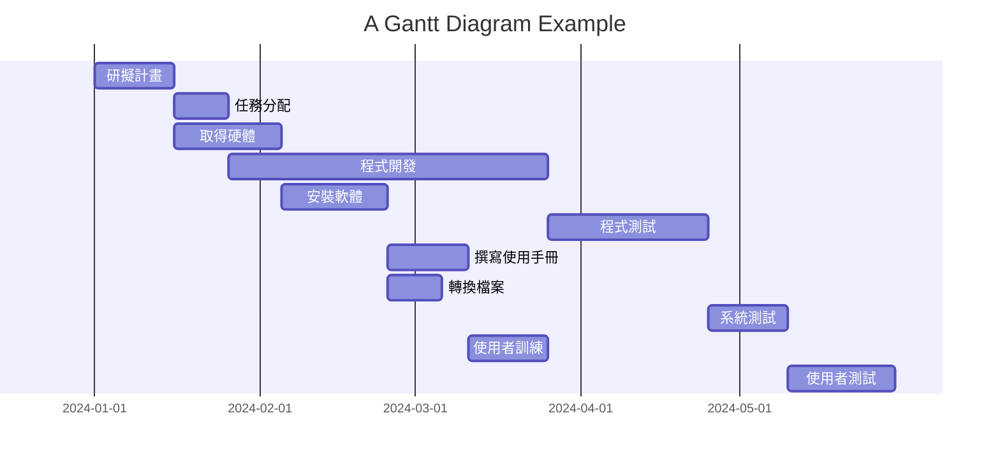
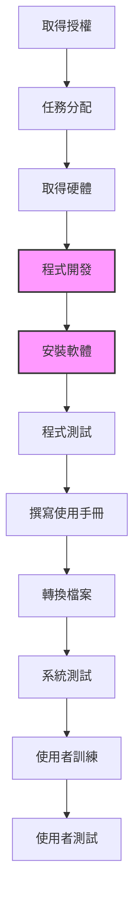

```mermaid
gantt
    title A Gantt Diagram Example

    dateFormat  YYYY-MM-DD
    axisFormat  %Y-%m-%d

    研擬計畫           :a1, 2024-01-01, 15d
    任務分配           :a2, after a1, 10d
    取得硬體           :a3, after a1, 20d

    程式開發           :a4, after a2, 60d
    安裝軟體           :a5, after a3, 20d

    程式測試           :a6, after a4, 30d
    撰寫使用手冊        :a7, after a5, 15d
    轉換檔案           :a8, after a5, 10d
    系統測試           :a9, after a6, 15d
    使用者訓練         :a10, after a7, 15d
    使用者測試         :a11, after a9, 20d
```

```mermaid
graph TD
    A[取得授權] --> B[任務分配]
    B --> C[取得硬體]
    C --> D[程式開發]
    D --> E[安裝軟體]
    E --> F[程式測試]
    F --> G[撰寫使用手冊]
    G --> H[轉換檔案]
    H --> I[系統測試]
    I --> J[使用者訓練]
    J --> K[使用者測試]

    style D fill:#f9f,stroke:#333,stroke-width:2px
    style E fill:#f9f,stroke:#333,stroke-width:2px

```

